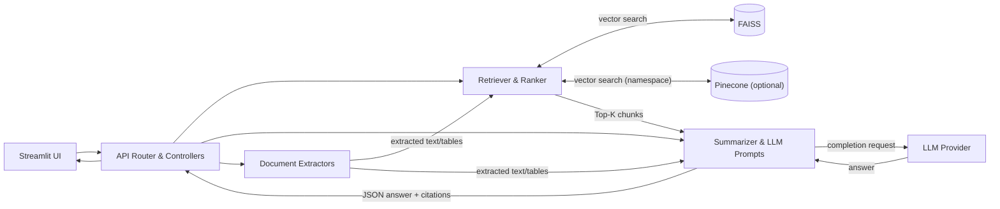

flowchart LR
  A["User/Client"] --> B["Retriever"]
  B --> E["Pinecone (optional)"]
  B --> F["BM25 / OpenSearch"]
  E --> C["Top-K Chunks"]
  F --> C
  C --> D["LLM (Prompt + Context)"]
  D --> G["Answer"]
# GenAI Doc Assistant

A simple, GitHub-safe README for a RAG + multimodal documentation assistant. This file avoids advanced Markdown features that commonly break rendering and includes a valid Mermaid diagram.

## Overview
- Ask natural-language questions over your docs with cited answers
- Summarize PDFs/images (OCR optional)
- Local FAISS KB with optional Pinecone

## Quickstart
```bash
python -m venv .venv
source .venv/bin/activate
pip install --upgrade pip
pip install -r requirements.txt
cp .env.example .env
# fill keys in .env if needed
```

## Run
```bash
# API
uvicorn app.api:app --reload --port 8000

# UI (in another terminal)
export API_BASE="http://127.0.0.1:8000"
python -m streamlit run app/streamlit_app.py --server.port 8503
```

## System Architecture



## API (example)
- `GET /health`
- `POST /ingest` — build local FAISS index
- `POST /ask` — question answering over local KB
- `POST /upsert_pinecone` — add texts to Pinecone (optional)
- `POST /ask_pinecone` — question answering over Pinecone (optional)

## Repo hygiene (avoid GitHub errors)
Add a `.gitignore` to prevent pushing large/temporary files:
```gitignore
.venv/
__pycache__/
*.pyc
*.pyo
*.pyd
.env
.env.*
.DS_Store
.ipynb_checkpoints/
```
> Never commit `.venv` or large binaries (e.g., `*.dylib`, `*.pt`). If you must track big artifacts, use Git LFS.

## Troubleshooting
- **Mermaid won’t render?** Ensure this code block starts with ```mermaid and uses simple labels in quotes as above.
- **Push rejected for >100MB file?** Remove the file, add it to `.gitignore`, and rewrite history using `git filter-repo` or BFG.

## License
MIT