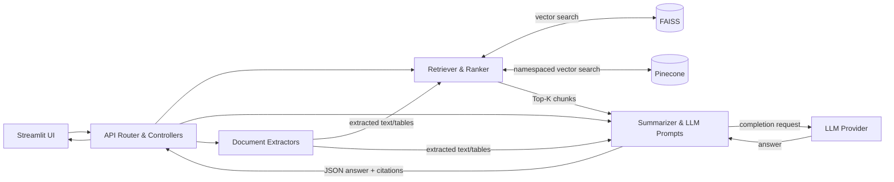

# GenAI Doc Assistant

[▶️ Demo Video](https://youtu.be/6-9tLGh20rI) • [📄 Report (PDF)](docs/Report.pdf) • [🌐 Project Web Page](https://patelyagna17.github.io/prompt-eng-final-project/)

<!-- Optional: clickable thumbnail -->
[](https://youtu.be/6-9tLGh20rI)

GenAI Doc Assistant is a retrieval-augmented generation (RAG) system for answering questions about user documents (PDFs/images) with citations. A Streamlit UI interacts with a FastAPI backend that handles ingestion, hybrid retrieval (FAISS local, optional Pinecone/BM25), prompt assembly, and OCR for scanned content. The design emphasizes faithfulness, reasonable latency, and graceful handling of uncertainty.

## Overview
- Ask natural-language questions over your docs with cited answers
- Summarize PDFs/images (OCR optional)
- Local FAISS KB with optional Pinecone

## Quickstart
```bash
python -m venv .venv
source .venv/bin/activate          # Windows: .venv\Scripts\activate
pip install --upgrade pip
pip install -r requirements.txt
cp .env.example .env               # fill keys if using cloud LLM/Pinecone
# fill keys in .env if needed
```

## Run
```bash
# API
uvicorn app.api:app --reload --port 8000

# UI (in another terminal)
export API_BASE="http://127.0.0.1:8000"
python -m streamlit run app/streamlit_app.py --server.port 8503
```

## System Architecture



## API (example)
- `GET /health`
- `POST /ingest` — build local FAISS index
- `POST /ask` — question answering over local KB
- `POST /upsert_pinecone` — add texts to Pinecone (optional)
- `POST /ask_pinecone` — question answering over Pinecone (optional)

## Repo hygiene (avoid GitHub errors)
Add a `.gitignore` to prevent pushing large/temporary files:
```gitignore
.venv/
__pycache__/
*.pyc
*.pyo
*.pyd
.env
.env.*
.DS_Store
.ipynb_checkpoints/
```
> Never commit `.venv` or large binaries (e.g., `*.dylib`, `*.pt`). If you must track big artifacts, use Git LFS.

## Troubleshooting
- **Mermaid won’t render?** Ensure this code block starts with ```mermaid and uses simple labels in quotes as above.
- **Push rejected for >100MB file?** Remove the file, add it to `.gitignore`, and rewrite history using `git filter-repo` or BFG.

## License
MIT